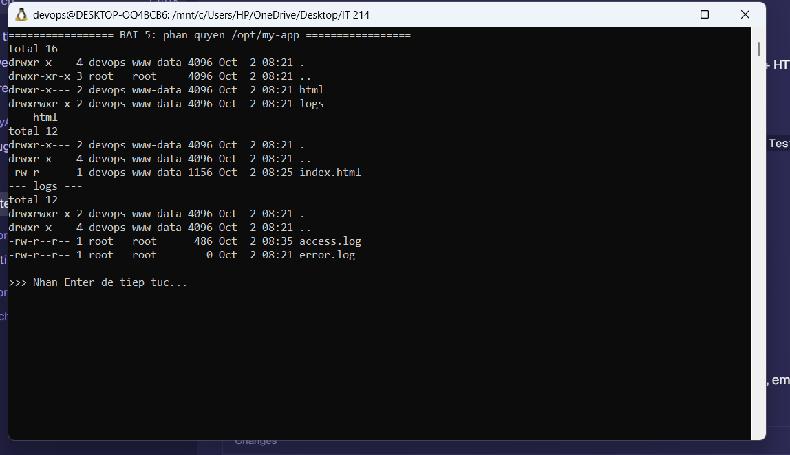
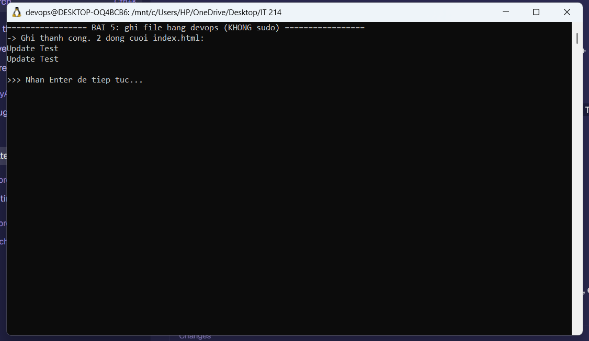
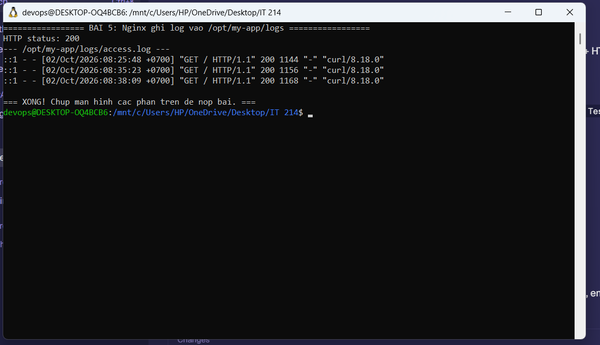

# Bài 5 (Session 03): Thiết lập thư mục Web an toàn tại phân vùng hệ thống (/opt/)

## 1. Mục tiêu

- Chuyển mã nguồn website tĩnh và thư mục logs ra khỏi đường dẫn mặc định sang **`/opt/my-app/`** để cô lập mã nguồn.
- Phân quyền nâng cao: **devops** (quản trị) và **www-data** (tiến trình Nginx) tách vai trò rõ ràng.
- Cấu hình Nginx ghi **access_log / error_log** trực tiếp vào `/opt/my-app/logs/`.

## 2. Cấu trúc thư mục

```
Ex05/
├── README.md
├── setup.sh                          # Script deploy + phân quyền
├── nginx/
│   └── my-app.conf                   # Server Block trỏ /opt/my-app + log riêng
└── opt/
    └── my-app/
        ├── html/index.html           # -> /opt/my-app/html/
        └── logs/.gitkeep             # -> /opt/my-app/logs/
```

## 3. Ràng buộc

- Mã nguồn: `/opt/my-app/html/`.
- Logs: `/opt/my-app/logs/`.
- Sở hữu đệ quy: **`devops:www-data`**.
- Quyền: thư mục `750` (hoặc 755), tệp `640` (hoặc 644).
- `www-data` được **đọc + thực thi** trên thư mục web, và **ghi** vào thư mục `logs/`.
- Nginx ghi `access_log` / `error_log` vào `/opt/my-app/logs/`.

## 4. Thực hiện

### 4.1. Tạo cấu trúc và phân quyền

```bash
sudo mkdir -p /opt/my-app/html /opt/my-app/logs
sudo cp opt/my-app/html/index.html /opt/my-app/html/index.html

# Chủ sở hữu: devops (owner) - www-data (group)
sudo chown -R devops:www-data /opt/my-app

# Thư mục 750, tệp 640
sudo find /opt/my-app -type d -exec chmod 750 {} \;
sudo find /opt/my-app -type f -exec chmod 640 {} \;

# Cho group www-data quyền GHI vào logs (để Nginx ghi log)
sudo chmod 775 /opt/my-app/logs
sudo chmod 755 /opt
```

| Đối tượng | html/ (750) | Tệp (640) | logs/ (775) |
|-----------|-------------|-----------|-------------|
| Owner `devops` | rwx | rw | rwx |
| Group `www-data` | r-x | r | rwx |
| Others | — | — | r-x |

### 4.2. Cấu hình Nginx

File `/etc/nginx/sites-available/my-app.conf` (nội dung: `nginx/my-app.conf`):

```nginx
server {
    listen 80;
    listen [::]:80;
    server_name _;

    root /opt/my-app/html;
    index index.html;

    location / { try_files $uri $uri/ =404; }

    access_log /opt/my-app/logs/access.log;
    error_log  /opt/my-app/logs/error.log;
}
```

```bash
sudo ln -sf /etc/nginx/sites-available/my-app.conf /etc/nginx/sites-enabled/my-app.conf
sudo rm -f /etc/nginx/sites-enabled/default
sudo nginx -t
sudo systemctl restart nginx
```

### 4.3. Chạy nhanh bằng script

```bash
chmod +x setup.sh
sudo ./setup.sh
```

## 5. Kiểm tra

**Phân quyền — `ls -la /opt/my-app/`:**

```
drwxr-x--- 4 devops www-data 4096 Oct  2 08:21 .
drwxr-xr-x 3 root   root     4096 Oct  2 08:21 ..
drwxr-x--- 2 devops www-data 4096 Oct  2 08:21 html
drwxrwxr-x 2 devops www-data 4096 Oct  2 08:21 logs

$ ls -la /opt/my-app/html/
drwxr-x--- 2 devops www-data 4096 Oct  2 08:21 .
drwxr-x--- 4 devops www-data 4096 Oct  2 08:21 ..
-rw-r----- 1 devops www-data 1144 Oct  2 08:21 index.html
```

→ Thư mục sở hữu `devops:www-data`, quyền `750`; tệp `640`; riêng `logs/` là `775` (group www-data ghi được).

**Ghi file bằng user devops (không sudo):**

```bash
$ echo "Update Test" >> /opt/my-app/html/index.html
$ tail -n 2 /opt/my-app/html/index.html
Update Test
Update Test
```

→ Ghi thành công, **không cần root**.

**Kiểm tra log:**

```bash
$ curl http://localhost/
HTTP status: 200

$ tail -n 3 /opt/my-app/logs/access.log
::1 - - [02/Oct/2026:08:24:33 +0700] "GET / HTTP/1.1" 200 1144 "-" "curl/8.18.0"
::1 - - [02/Oct/2026:08:25:48 +0700] "GET / HTTP/1.1" 200 1144 "-" "curl/8.18.0"
::1 - - [02/Oct/2026:08:25:48 +0700] "GET / HTTP/1.1" 200 1144 "-" "curl/8.18.0"
```

→ Nginx trả `200 OK`, **không lỗi 403**, và tự ghi log vào `/opt/my-app/logs/access.log`.

## 6. Ảnh chụp màn hình







## 7. Kết luận

- Mã nguồn và logs được cô lập trong `/opt/my-app/`, tách khỏi phân vùng mặc định.
- Thư mục thuộc sở hữu chính xác `devops:www-data`.
- `devops` ghi file không cần sudo; `www-data` đọc được web và ghi được logs.
- Nginx hoạt động bình thường, không lỗi 403, tự động ghi log vào đường dẫn chỉ định.
